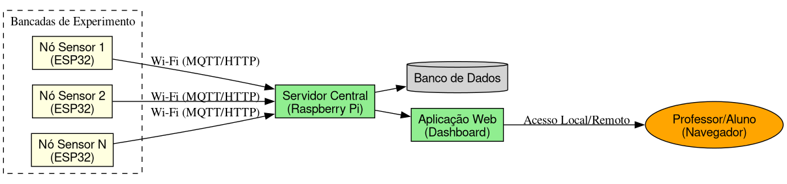

# Introdução

## O Problema
- Laboratórios de Física dependem de sistemas proprietários (DAQ).
- **Alto custo** de aquisição e manutenção.
- Uso de smartphones gera distrações e falta de padronização.
- Sistemas isolados dificultam o acompanhamento docente de múltiplos grupos.

## A Solução Proposta
- Uso de microcontroladores de baixo custo (ESP32).
- Comunicação sem fio (Wi-Fi) para centralização de dados.
- Interface web amigável para monitoramento em tempo real.

# Objetivos

## Objetivo Geral
Construir e validar um sistema de aquisição e monitoramento centralizado para múltiplos experimentos didáticos via rede sem fio.

## Objetivos Específicos
- Avaliar plataformas de hardware (Custo x Benefício).
- Projetar a arquitetura de software (Firmware + Servidor Web).
- Implementar uma Prova de Conceito (Carga e Descarga de Capacitor).
- Validar a usabilidade e o custo da solução.

# Arquitetura do Sistema

## Diagrama da Solução
{width=80%}

# Metodologia

## Abordagem
- **Natureza:** Pesquisa Aplicada.
- **Objetivo:** Exploratório e Desenvolvimento Tecnológico.
- **Stack Tecnológica:**
    - **Nós:** ESP32 (C++, Arduino framework).
    - **Servidor:** Raspberry Pi (Python/Node.js + Banco de Dados).
    - **Comunicação:** Wi-Fi (MQTT ou HTTP).

# Desenvolvimento

## Etapas do TCC II
1. **Especificação:** Escolha final dos componentes.
2. **Firmware:** Coleta de dados analógicos e transmissão.
3. **Backend/Frontend:** Painel de controle e persistência.
4. **Integração:** Montagem física do experimento de capacitor.

# Validação e Resultados Esperados

## Métricas de Sucesso
- **Custo:** Comparação direta com equipamentos comerciais (Vernier, Pasco).
- **Usabilidade:** Avaliação da facilidade de uso para o professor.
- **Escalabilidade:** Capacidade de monitorar 10+ bancadas simultaneamente.

# Cronograma

## TCC II (2026.2)
- **Jul-Ago:** Desenvolvimento do Hardware e Firmware.
- **Set-Out:** Aplicação Web e Prova de Conceito.
- **Nov:** Validação e Redação Final.
- **Dez:** Defesa.

# Conclusão

## Contribuições
- Democratização do acesso à instrumentação científica.
- Redução da ociosidade de hardware nos laboratórios.
- Base para experimentos remotos e híbridos.

---

## Dúvidas?
\begin{center}
Obrigado! \\
\vspace{1cm}
\textbf{Victor Hugo Bitencourt} \\
Orientador: Prof. Dr. Cláudio Alves de Amorim
\end{center}
