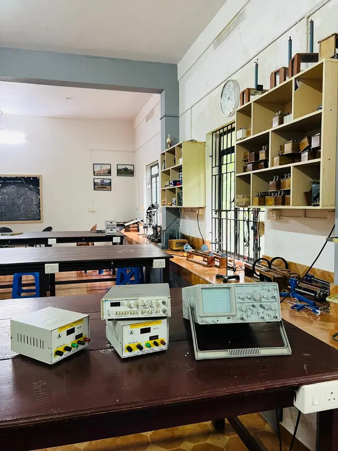
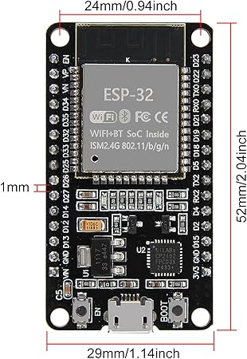
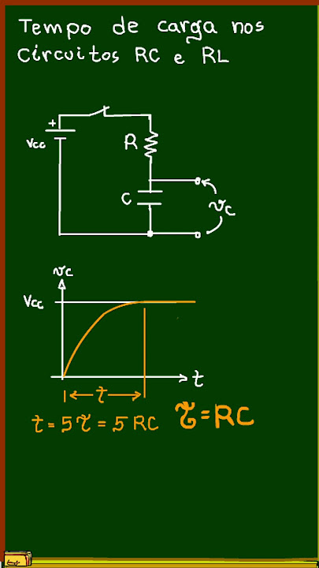
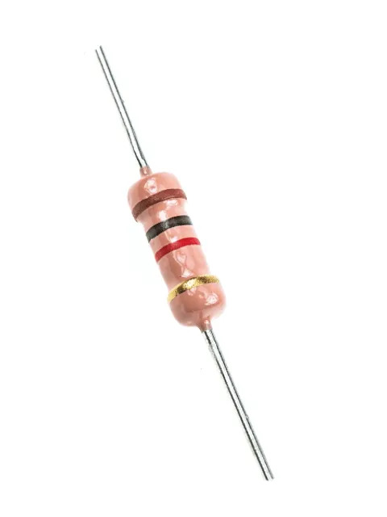
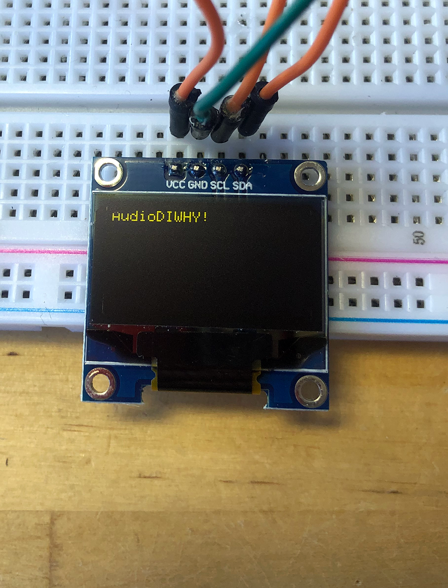
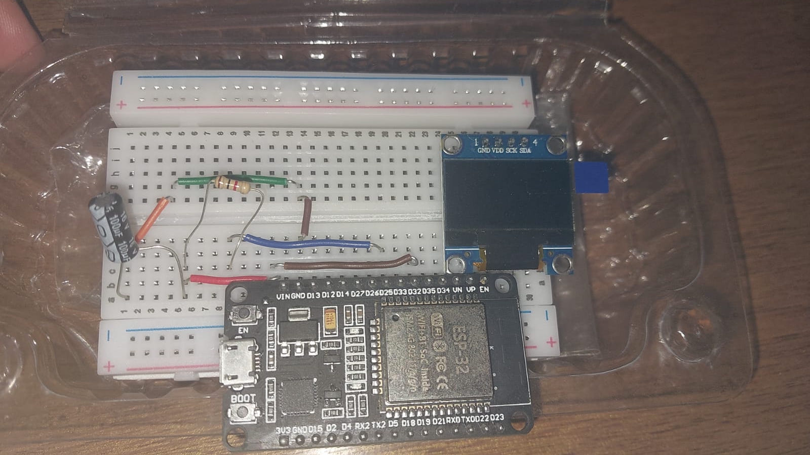

# Problema de Pesquisa

A fragmentação da infraestrutura tecnológica e o isolamento dos dados em laboratórios didáticos tradicionais.

# Contexto Laboratorial

:::::::::::::: {.columns}
::: {.column width="50%"}

- Laboratórios de física tradicionais frequentemente operam de forma isolada, exigindo hardware dedicado por bancada.

- A ausência de uma rede integrada de dados dificulta a gestão centralizada.

- O professor enfrenta dificuldades para monitorar múltiplos grupos simultaneamente.

- Há uma lacuna entre o aparato de aquisição de sinais e o ambiente de processamento de informações.
:::

::: {.column width="50%"}

:::
::::::::::::::

# Objetivos do Projeto

## Objetivo Geral

- Projetar uma infraestrutura orquestrada via Wi-Fi baseada em microcontrolador ESP32 e coordenação central Raspberry Pi.

## Interface com o Usuário

- Implementar uma interface com o usuário para acesso a dados da telemetria.

## Prova de Conceito

- Demonstrar a arquitetura através da digitalização de dados reais provenientes do experimento do Circuito Resistor-Capacitor (RC).

# Fundamentação Teórica

:::::::::::::: {.columns}
::: {.column width="50%"}
**A Prática e o Ensino**

* A experimentação ativa é o elo necessário entre a teoria abstrata matemática e a formação científica. Conforme a literatura, alunos assimilam melhor o conhecimento quando expostos aos ruídos intrínsecos de experimentos reais, divergindo da idealização pura observada em simuladores virtuais padronizados.
:::

::: {.column width="50%"}
**Embarcados e Orquestração**

* Microcontroladores modernos atuam como nós de borda robustos. Ao integrar processamento com comunicação em rede (IoT), o hardware é capaz de adquirir os sinais de baixo nível, formatá-los, e delegar toda a persistência de longo prazo e renderização visual para um servidor centralizado e escalável.
:::
::::::::::::::

# Arquitetura Proposta

- **Aquisição de Dados:** Utilização do ESP32 operando sobre o framework Arduino (C/C++) para leitura analógica da bancada.
- **Comunicação Leve:** Disparo de pacotes com resultados consolidados em formato JSON por meio do protocolo HTTP.
- **Servidor Desacoplado:** Abstrai o armazenamento das medições e serviço de telemetria.
- **Interface Comum:** Os alunos acessam as plotagens a partir de qualquer dispositivo conectado à rede.

# Arquitetura Proposta

# Justificativas Técnicas

:::::::::::::: {.columns}
::: {.column width="50%"}

:::

::: {.column width="50%"}

:::
::::::::::::::

# Prova de Conceito (RC)

:::::::::::::: {.columns}
::: {.column width="50%"}

A análise do circuito RC expõe o estudante ao comportamento da transição energética. A orquestração digital desses dados via telemetria educacional será utilizada para demonstrar a viabilidade técnica da arquitetura, permitindo o confronto do modelo ideal com medições físicas.
:::

::: {.column width="50%"}

:::
::::::::::::::

# Prova de Conceito (RC)

## A constante tempo

$$\tau = RC$$

## Tensão de Carga

$$v_c(t) = V_s \left( 1 - e^{-\frac{t}{\tau}} \right)$$

## Tensão de Descarga

$$v_c(t) = V_0 e^{-\frac{t}{\tau}}$$

# Prova de Conceito (RC)

:::::::::::::: {.columns}
::: {.column width="50%"}

:::

::: {.column width="50%"}

:::
::::::::::::::

# Prova de Conceito (RC)

:::::::::::::: {.columns}
::: {.column width="50%"}

:::

::: {.column width="50%"}

:::
::::::::::::::

# Prova de Conceito (RC)

:::::::::::::: {.columns}
::: {.column width="50%"}

:::

::: {.column width="50%"}

:::
::::::::::::::

# Resultados Preliminares

# Cronograma

| Etapa | Período |
| --- | --- |
| *Firmware* | Julho - Agosto |
| Armazenamento e Interface com Usuário | Agosto - Setembro |
| Refinamentos na Orquestração Experimental | Setembro |
| Avaliação dos resultados | Outubro - Novembro |
| Redação do Trabalho Final | Outubro - Novembro |
| Defesa do Trabalho Final | Dezembro |

# Referências
