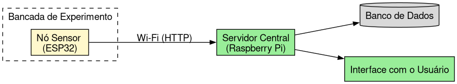
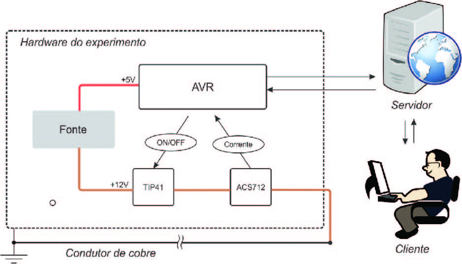
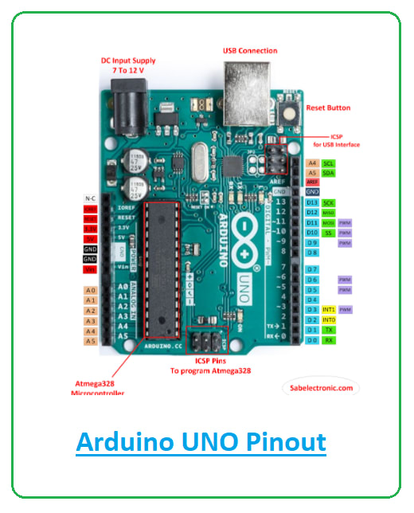
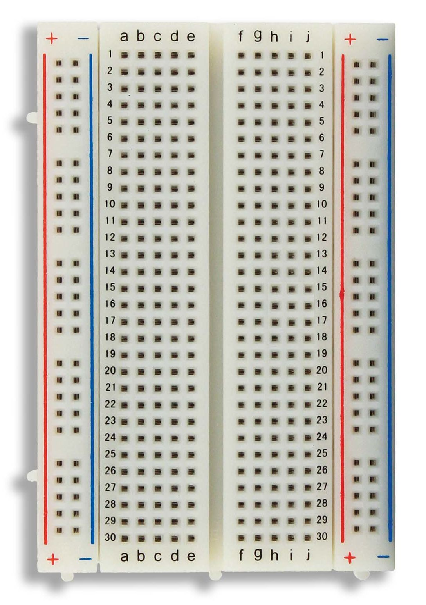
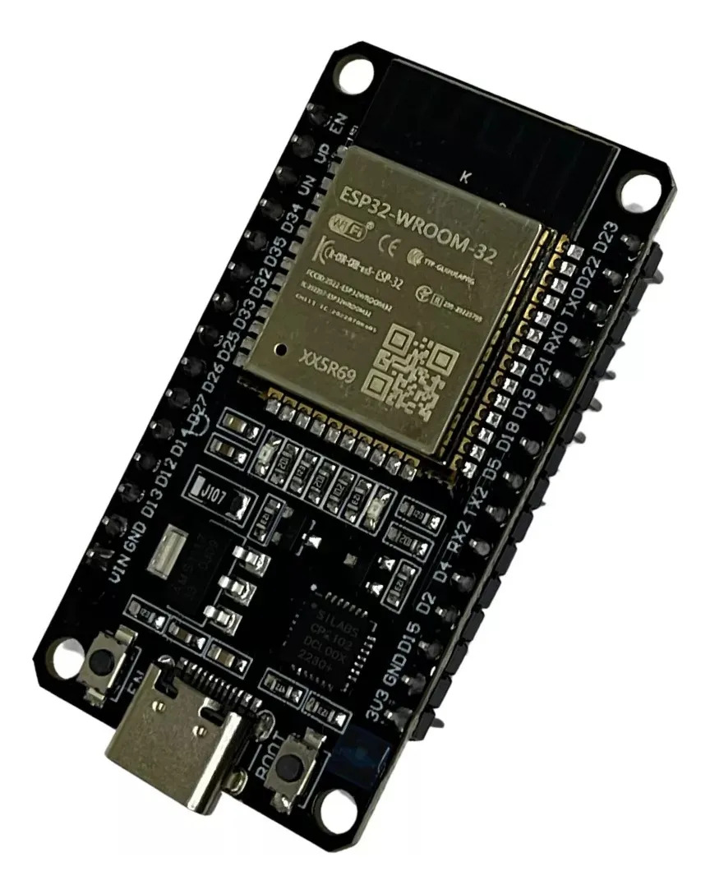
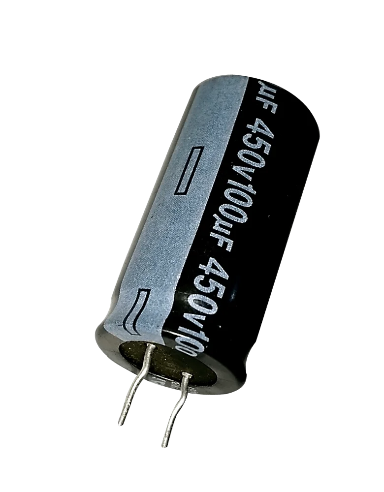
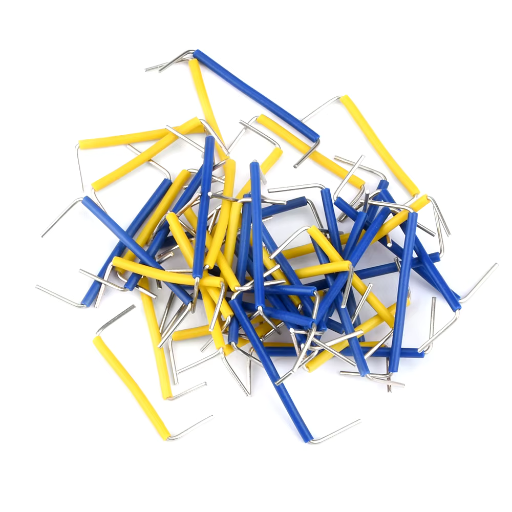
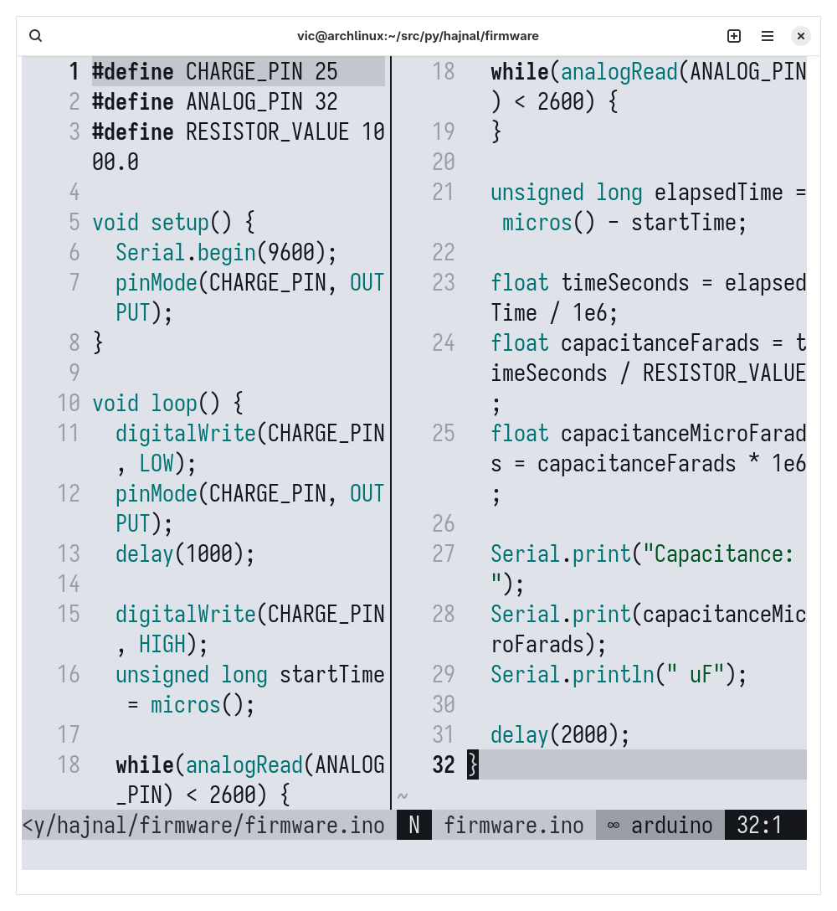
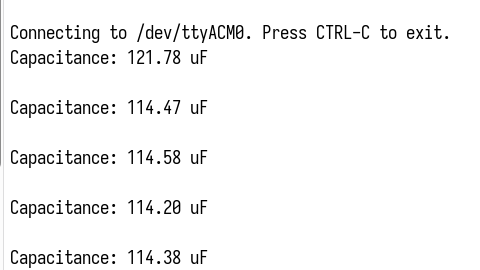

# Problema de Pesquisa

A fragmentação da infraestrutura tecnológica e o isolamento dos dados em laboratórios didáticos tradicionais.

# Contexto Laboratorial

:::::::::::::: {.columns}
::: {.column width="50%"}

- Laboratórios de física tradicionais frequentemente operam de forma isolada, exigindo hardware dedicado por bancada.

- A ausência de uma rede integrada de dados dificulta a gestão centralizada.

- O professor enfrenta dificuldades para monitorar múltiplos grupos simultaneamente.

- Há uma lacuna entre o aparato de aquisição de sinais e o ambiente de processamento de informações.
:::

::: {.column width="50%"}

:::
::::::::::::::

# Objetivos do Projeto

## Objetivo Geral

- Projetar uma infraestrutura orquestrada via Wi-Fi baseada em microcontrolador ESP32 e coordenação central Raspberry Pi.

## Interface com o Usuário

- Implementar uma interface com o usuário para acesso a dados da telemetria.

## Prova de Conceito

- Demonstrar a arquitetura através da digitalização de dados reais provenientes do experimento do Circuito Resistor-Capacitor (RC).

# Fundamentação Teórica

:::::::::::::: {.columns}
::: {.column width="50%"}
**A Prática e o Ensino**

* A experimentação ativa é o elo necessário entre a teoria abstrata matemática e a formação científica. Conforme a literatura, alunos assimilam melhor o conhecimento quando expostos aos ruídos intrínsecos de experimentos reais, divergindo da idealização pura observada em simuladores virtuais padronizados (CHEN, 2026).
:::

::: {.column width="50%"}
**Embarcados e Orquestração**

* Microcontroladores modernos atuam como nós de borda robustos. Ao integrar processamento com comunicação em rede, o hardware é capaz de adquirir os sinais de baixo nível, formatá-los, e delegar toda a persistência de longo prazo e renderização visual para um servidor centralizado e escalável (MARTINS, 2023).
:::
::::::::::::::

# Arquitetura Proposta

- **Aquisição de Dados:** Utilização do ESP32 operando sobre o framework Arduino (C/C++) para leitura analógica da bancada.
- **Comunicação Leve:** Disparo de pacotes com resultados consolidados em formato JSON por meio do protocolo HTTP.
- **Servidor Desacoplado:** Abstrai o armazenamento das medições e serviço de telemetria.
- **Interface Comum:** Os usuários acessam os resultados a partir de qualquer dispositivo conectado à rede.

# Arquitetura Proposta

# Arquitetura Proposta

# Justificativas Técnicas

:::::::::::::: {.columns}
::: {.column width="50%"}

:::

::: {.column width="50%"}

:::
::::::::::::::

# Prova de Conceito (RC)

:::::::::::::: {.columns}
::: {.column width="50%"}

A análise do circuito RC pode expôr o estudante ao comportamento da transição energética, trazendo a possibilidade de comparação entre o modelo ideal e a realidade (KOWALSKI, 2024). A orquestração digital desses dados via telemetria educacional será utilizada para demonstrar a viabilidade técnica da arquitetura, permitindo o confronto do modelo ideal com medições físicas.
:::

::: {.column width="50%"}

:::
::::::::::::::

# Prova de Conceito (RC)

## A constante tempo

$$\tau = RC$$

## Tensão de Carga

$$v_c(t) = V_s \left( 1 - e^{-\frac{t}{\tau}} \right)$$

## Tensão de Descarga

$$v_c(t) = V_0 e^{-\frac{t}{\tau}}$$

# Prova de Conceito (RC)

:::::::::::::: {.columns}
::: {.column width="50%"}

:::

::: {.column width="50%"}

:::
::::::::::::::

# Prova de Conceito (RC)

:::::::::::::: {.columns}
::: {.column width="50%"}

:::

::: {.column width="50%"}

:::
::::::::::::::

# Prova de Conceito (RC)

:::::::::::::: {.columns}
::: {.column width="50%"}

:::

::: {.column width="50%"}

:::
::::::::::::::

# Resultados Preliminares

# Resultados Preliminares

# Resultados Preliminares

# Cronograma

| Etapa | Período |
| --- | --- |
| *Firmware* | Julho - Agosto |
| Armazenamento e Interface com Usuário | Agosto - Setembro |
| Refinamentos na Orquestração Experimental | Setembro |
| Avaliação dos resultados | Outubro - Novembro |
| Redação do Trabalho Final | Outubro - Novembro |
| Defesa do Trabalho Final | Dezembro |

# Referências

- NINO, D.; WANG, H.; MILSTEIN, J. N. Rapid feedback control and stabilization of an optical tweezers with a budget microcontroller. European Journal of Physics, IOP Publishing, v. 35, n. 5, p. 055009, jul 2014. Disponível em: https://doi.org/10.1088/0143-0807/35/5/055009. Citado na página 20.
- CHEN, Y. Teaching taylor series with rocket landing: Kinematics, approximations, and engineering insights. European Journal of Physics, v. 47, 03 2026. Citado na página 18.
- ALLAFI, I.; IQBAL, M. T. Design and implementation of a low cost web server using esp32 for real-time photovoltaic system monitoring. In: . [S.l.: s.n.], 2017. p. 1–5. Citado na página 20.

# Referências

- KOWALSKI, F. V. The process of constructing new knowledge: an undergraduate laboratory exercise facilitated by a vacuum capacitor-resistor circuit. European Journal of Physics, IOP Publishing, v. 45, n. 5, p. 055201, 2024. ISSN 1361-6404. Disponível em: http://dx.doi.org/10.1088/1361-6404/ad6cb4. Citado na página 18.
- CAETANO, T. C.; MOREIRA, C. C.; OLIVEIRA, I. D. de. Desenvolvimento de um experimento didático operável remotamente para o ensino de termometria: um método para a determinação do coeficiente de dilatação linear do cobre baseadoem efeito joule. Revista Brasileira de Ensino de Física, Sociedade Brasileira de Física - SBF, v. 44, p. e20220125, 2022. ISSN 1806-1117. Disponível em: https://doi.org/10.1590/1806-9126-RBEF-2022-0125. Citado na página 15.

# Conclusão

## Dúvidas?
