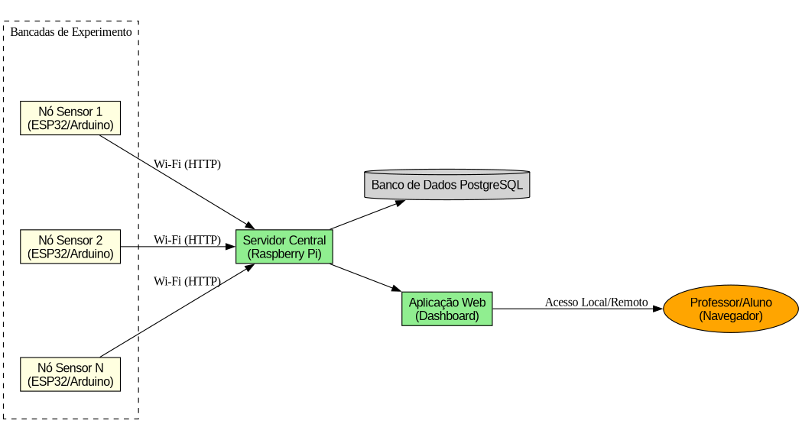
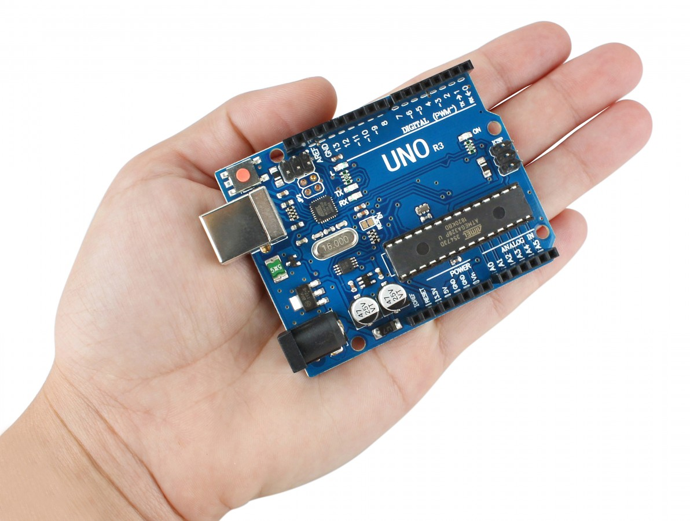
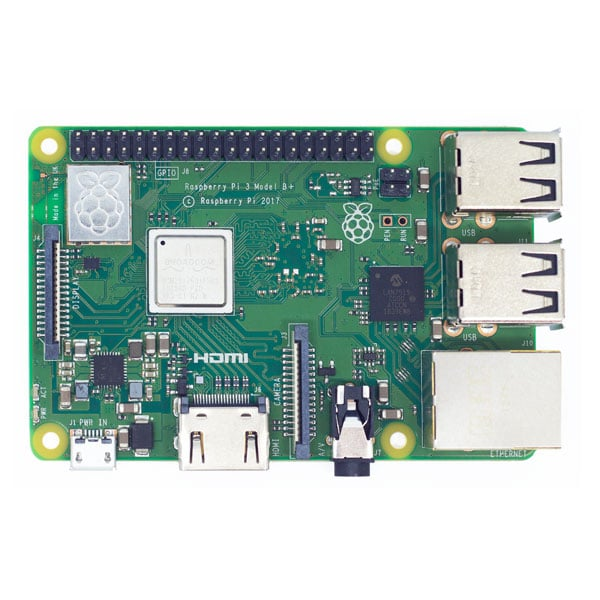

# Introdução

## O Problema
- Laboratórios de Física dependem de sistemas proprietários (DAQ).
- **Alto custo** de aquisição e manutenção.
- Sistemas isolados dificultam o acompanhamento docente de múltiplos grupos.

## Questão de Pesquisa

- Como desenvolver e avaliar uma arquitetura de baixo custo, baseada em comunicação sem fio, voltada para o âmbito educacional, para a aquisição e monitoramento centralizado de experimentos em laboratórios de Física?

# Objetivos

## Objetivo Geral
Construir e avaliar um sistema de aquisição e monitoramento centralizado para múltiplos experimentos didáticos via rede sem fio.

## Objetivos Específicos
- Avaliar plataformas de hardware (Custo x Benefício através de uma tabela comparativa).
- Projetar a arquitetura de software (Firmware + Servidor Web).
- Implementar uma Prova de Conceito (Carga e Descarga de Capacitor).

# Intervenção Proposta
- Uso de microcontroladores de baixo custo (como ESP32 ou Arduino UNO).
- Comunicação sem fio (Wi-Fi) para centralização de dados em um servidor de baixo custo (como Raspberry Pi).
- Interface web amigável para monitoramento em tempo real.

# Arquitetura do Sistema

{width=80%}

# Hardware
::: columns
::: {.column width="33%"}
{width=100%}
:::
::: {.column width="33%"}
{width=100%}
:::
::: {.column width="33%"}
{width=100%}
:::
:::

# Metodologia

## Abordagem
- **Natureza:** Pesquisa Aplicada e Experimental.
- **Objetivo:** Exploratório e Desenvolvimento Tecnológico.
- **Etapas:**
    1. **Especificação:** Escolha final dos componentes.
    2. **Modulo Firmware:** Coleta de dados analógicos e transmissão.
    3. **Modulo Web** Painel de controle e persistência.

# Desenvolvimento

- **Stack Tecnológica:**
    - **Nós:** ESP32 ou Arduino UNO (C++, Arduino framework).
    - **Servidor:** Raspberry Pi (Python + Banco de Dados PostgreSQL).
    - **Comunicação:** Wi-Fi (comunicação via protocolo HTTP).

# Avaliação e Resultados Esperados

## Métricas de Sucesso
- **Custo:** Comparação direta com equipamentos comerciais (ex: Vernier, Pasco).
- **Escalabilidade:** Capacidade de monitorar 10+ bancadas simultaneamente.

# Cronograma

## TCC II (2026.2)
- **Jun-Jul:** Desenvolvimento do Modulo Firmware com experimento integrado (log de dados via Serial).
- **Ago** Desenvolvimento do Modulo Web (com armazenamento de dados e interface gráfica)
- **Set:** Refinamentos finais na camada de controle e orquestração dos dispositivos clientes (microcontroladores nas bancadas de experimentos)
- **Out-Nov:** Avaliações dos resultados e Redação Final.
- **Dez:** Defesa.

# Conclusão

## Contribuições
- Democratização do acesso à instrumentação científica.
- Redução da ociosidade de hardware nos laboratórios.
- Base para experimentos remotos e híbridos.

---

## Dúvidas?
\begin{center}
Obrigado! \\
\vspace{1cm}
\textbf{Victor Hugo Bitencourt} \\
Orientador: Prof. Dr. Cláudio Alves de Amorim
\end{center}
